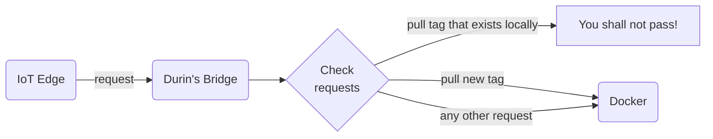

# Durin's Bridge
A small unix-domain socket proxy that can intercept and block or modify requests to the Docker Engine.
The purpose of the bridge is to regain some fine-grained control on 3rd party tools that interact with Docker
in ways we don't want it to.



### Usage
```shell
Durins Bridge is the bridge that separates the trusted       ,---.
Docker land socket from the dark unknown                    /    |
mines of userland. It is guarded by a                      /     |
powerfull wizard - and if any unwanted                    /      |
commands enter, they SHALL NOT PASS!                     /       |
                                                    ___,'        |
                                                  <  -'          :
                                                   '-.__..--'''-,_\_
                                                      |o/ ' :,.)_'>
                                                      :/ '     ||/)
                                                      (_.).__,-' |\
                                                      /( '.''   '| :
                                                      \''-.)  '  ; ;
                                                      | '       /-<
                                                      |     '  /   '.
                                      ,-_-..____     /|  '    :__..-'\
                                     /,'-.__\\  ''-./ :'      ;       \
                                     '\ '\  '\\  \ :  (   '  /  ,   '. \
                                       \' \   \\   |  | '   :  :     .\ \
                                        \ '\_  ))  :  ;     |  |      ): :
                                       ('-.-'\ ||  |\ \   ' ;  ;       | |
                                        \-_   ';;._   ( '  /  /_       | |
                                         '-.-.// ,''-._\__/_,'         ; |
                                            \:: :     /     '     ,   /  |
                                             || |    (        ,' /   /   |
                                             ||                ,'   /    |

Usage:
  durins-bridge [command]

Available Commands:
  activate    Accepts sockets created by systemd
  create      Creates proxy-sockets

Flags:
  -h, --help               help for durins-bridge
  -l, --log-level string   Sets the minimum log level to print (default "info")

Use "durins-bridge [command] --help" for more information about a command.
```